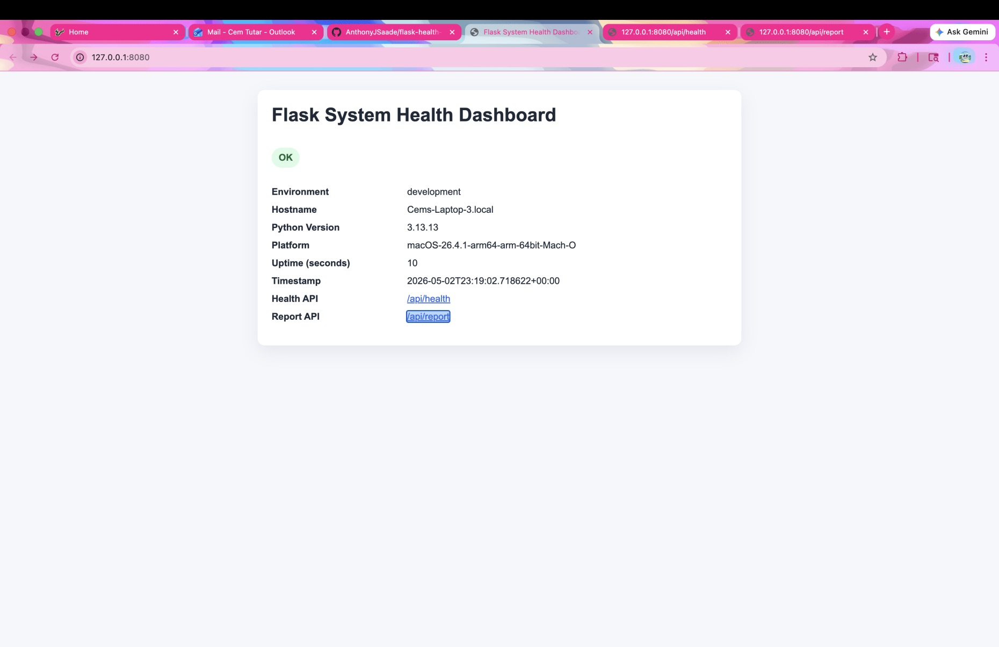
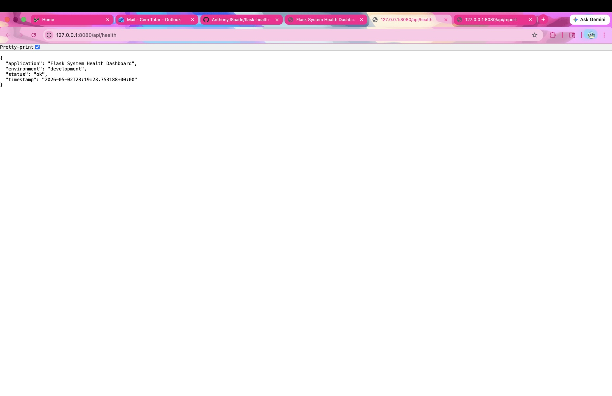
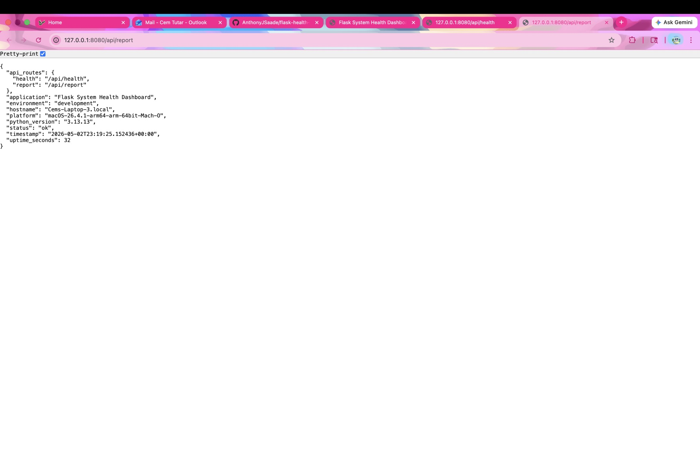
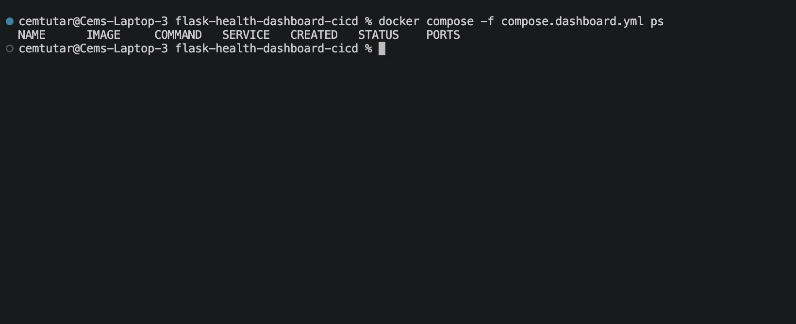
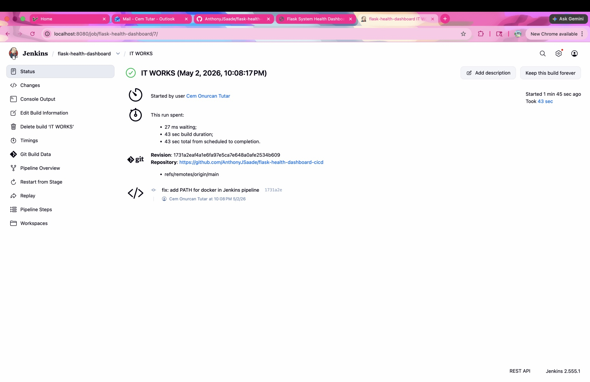

# Project Report — CI/CD Pipeline for Automated Deployment of a Flask System Health Dashboard

## 1. Project Overview

This project demonstrates a realistic DevOps workflow connecting five industry tools in one automated pipeline. A Flask web application is version-controlled in GitHub, tested automatically, packaged into a Docker image, deployed with Docker Compose, and the entire workflow is driven by Jenkins.

The application is a System Health Dashboard: a lightweight Flask app that reports runtime system information including hostname, Python version, platform, uptime, and environment label through both a browser UI and JSON API endpoints.

---

## 2. Tools Used

| Tool           | Version Used  | Purpose                                              |
|----------------|---------------|------------------------------------------------------|
| GitHub         | —             | Source control and team collaboration                |
| Jenkins        | 2.555.1       | CI/CD automation — checkout, test, build, deploy, verify |
| Docker         | 24+           | Packages Flask app into a portable container image   |
| Docker Compose | v2 (plugin)   | Runs the application stack with a single command     |
| Flask          | 3.0.3         | Python web framework for the dashboard application   |

This project uses **5 tools** in one coherent workflow, exceeding the minimum requirement of 3.

---

## 3. Architecture Summary

```
Developer Pushes Code
        |
        v
  GitHub Repository
        |
        v
  Jenkins Pipeline
     |         |
     v         v
  Run        Build
  Tests      Docker Image
               |
               v
         Docker Compose
         Deployment
               |
               v
    Flask Health Dashboard
    localhost:8080
               |
               v
    Jenkins curl Verification
    /api/health  /api/report
```

See [ARCHITECTURE.md](ARCHITECTURE.md) for a full breakdown of each component and file.

---

## 4. Application Routes

| Route        | Response Type | Description                             |
|--------------|---------------|-----------------------------------------|
| `/`          | HTML          | Browser dashboard with system info      |
| `/api/health`| JSON          | App name, status, environment, timestamp |
| `/api/report`| JSON          | Full system report including hostname, Python version, platform, uptime |

---

## 5. Jenkins Pipeline Stages

| Stage                    | Description                                                  |
|--------------------------|--------------------------------------------------------------|
| Checkout                 | Clones the repository from GitHub                            |
| Run Route Tests          | Creates a Python venv, installs Flask, runs unittest         |
| Build Docker Image       | Builds `flask-health-dashboard:latest` from `Dockerfile`     |
| Deploy with Docker Compose | Starts the `app` service via `compose.dashboard.yml`       |
| Verify Deployment        | Curls `/api/health` and `/api/report` to confirm the app responds |
| Show Compose Status      | Displays `docker compose ps` and last 25 log lines               |
| Cleanup                  | Tears down the Compose stack                                 |

The pipeline performs real automation: it runs tests, builds an image, deploys a container, and verifies routes — not just print statements.

---

## 6. How to Run the Project

### Local (no Docker)
```bash
python3 -m venv .venv && source .venv/bin/activate
pip install -r requirements.txt
python app.py
```

### Docker Compose
```bash
docker compose -f compose.dashboard.yml up -d --build
curl http://localhost:8080/api/health
```

### Full setup steps and troubleshooting: see [RUNBOOK.md](RUNBOOK.md)

---

## 7. Team Contributions

| Member   | Role                              | Key Deliverables                                      |
|----------|-----------------------------------|-------------------------------------------------------|
| Cem Tutar | Jenkins and Integration Lead      | `Jenkinsfile`, Jenkins pipeline configuration, PATH fix, ansiColor fix |
| AnthonyJSaade | Flask Application and Testing Lead | `app.py`, `diagnostics.py`, `config.json`, `requirements.txt`, `tests/test_routes.py`, Jenkins test stage |
| Deepesh Managuru | Docker, Compose, and Documentation Lead | `Dockerfile`, `compose.dashboard.yml`, `.dockerignore`, `docs/`, Jenkins Compose status stage |

Collaboration evidence: GitHub commit history, pull requests, and branch history visible in the repository.

---

## 8. Screenshots

### Application

**Flask Dashboard in Browser**



**`/api/health` Endpoint**



**`/api/report` Endpoint**



### Docker Compose

**Docker Compose Running**



### Jenkins

**Jenkins Pipeline**



---

## 9. Lessons Learned

- Dependency order matters: the Flask app must exist before Docker can build, and Docker files must exist before Jenkins can deploy. Planning the sequence up front prevented blockers.
- Jenkins and Docker port conflicts are common. If Jenkins occupies port 8080, the Flask host port must be remapped and kept consistent across `compose.dashboard.yml` and `Jenkinsfile`.
- Splitting requirements.txt COPY from the rest of the app in the Dockerfile takes advantage of Docker layer caching, making repeated builds faster.
- Running unit tests inside Jenkins before the Docker build catches application errors early, before any container overhead is involved.
- Including the Jenkins agent PATH for `/usr/local/bin` ensures Docker is available during pipeline execution on macOS.
